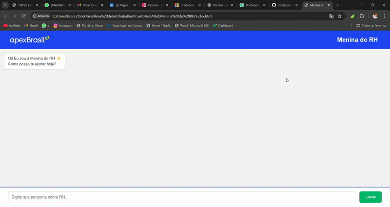

# 🤖 Menina do RH – Chatbot com RAG + Claude 3 (versão genérica)

Este é um projeto de demonstração de um chatbot baseado em **RAG (Retrieval-Augmented Generation)** com **Claude 3 Haiku**, desenvolvido para responder perguntas a partir de documentos internos segmentados.

> ⚠️ Esta versão é genérica. Nenhum dado real ou sensível foi incluído.

---

## 💡 Como funciona?

1. **Segmenta documentos** em chunks com base em estrutura numérica.
2. **Gera embeddings vetoriais** com o modelo `intfloat/multilingual-e5-base`.
3. **Indexa com FAISS** para busca por similaridade.
4. **Busca os trechos mais relevantes** com base na pergunta.
5. **Envia os trechos para a Claude 3 (via OpenRouter)** que gera a resposta com base no contexto.

---

## 🛠 Tecnologias utilizadas

- Python
- FAISS (busca vetorial)
- Sentence Transformers
- Claude 3 Haiku (via OpenRouter)
- `.env` para variáveis sensíveis

---

## 🚀 Como rodar

1. Clone o repositório:
```bash
git clone https://github.com/BrennoLopess/inteligencia-artificial.git
cd inteligencia-artificial/menina-do-rh
```

2. Instale as dependências:
```bash
pip install -r requirements.txt
```

3. Crie um arquivo `.env` com sua chave da OpenRouter:
```env
OPENROUTER_API_KEY=sk-xxxxxxxxxxxxxxxx
```

4. Execute os scripts na ordem:
```bash
python 00_segmentar_txt_em_chunks.py
python 01_gerar_embeddings_faiss.py
python 03_gerar_resposta_claude.py  # Ou usar a busca antes com 02
```

---

## 🧪 Exemplo de pergunta

```bash
"Como funciona o plano odontológico da empresa?"
"Quais são as regras do vale alimentação?"
```

---


## 💻 Demonstração Visual

Abaixo, algumas capturas reais da Menina do RH em funcionamento:

### Tela inicial


### Opções de ajuda disponíveis


### Resposta detalhada sobre plano odontológico


### 🌀 Demonstração em GIF




## 📌 Observações

- A IA responde com base **apenas nos trechos encontrados via FAISS**.
- As perguntas podem ser genéricas, desde que façam sentido com o conteúdo dos exemplos.

---

## 🤝 Contribuições

Este projeto é um exemplo de como IA Generativa pode ser aplicada com segurança e controle para resolver dúvidas com base em documentos institucionais.

---

> Feito por [@BrennoLopess](https://github.com/BrennoLopess)
